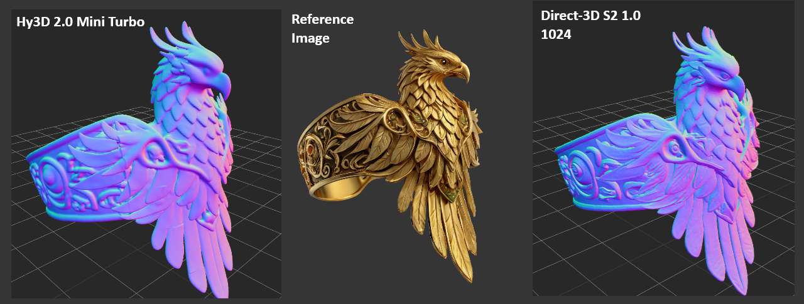

# ComfyUI-Direct3D-S2



[Direct3D-S2](https://github.com/DreamTechAI/Direct3D-S2) ComfyUI Wrapper
(Python v3.10, v3.11 or v3.12)

Supported Models: 1.0 and 1.1

Can be used to refine existing mesh from Hy3D 2.0/2.1 etc or construct dense mesh from image.

## VRAM Requirements
- **8GB VRAM:** Confirmed working (CPU offloaded, very slow)
- **12GB VRAM:** Minimum Recommended (Slow CPU offloading in complex cases)
- **16–24GB VRAM:** Ideal for best performance

# Installation

## Install requirements

```bash
cd ComfyUI\custom_nodes\ComfyUI-Direct3D-S2
..\..\..\..\python_embeded\python.exe -m pip install -r requirements.txt
```

## Install voxelize

```bash
cd ComfyUI\custom_nodes\ComfyUI-Direct3D-S2
..\..\..\..\python_embeded\python.exe setup.py install
```

## Install torchsparse

Linux: `pip install torchsparse`

Windows: You will find wheels in the folder `wheels`

## Install Flash Attention

Linux: `pip install flash_attn`

Windows: You can find precompiled wheels here [https://huggingface.co/lldacing/flash-attention-windows-wheel/tree/main](https://huggingface.co/lldacing/flash-attention-windows-wheel/tree/main)

## Download the models

You will find the models here: [https://huggingface.co/wushuang98/Direct3D-S2/tree/main](https://huggingface.co/wushuang98/Direct3D-S2/tree/main)

### Clone HuggingFace Repository
```bash
cd ComfyUI/models
mkdir -p wushuang98
cd wushuang98
git clone https://huggingface.co/wushuang98/Direct3D-S2
```

Final structure should look like:

```
ComfyUI/models/wushuang98/Direct3D-S2/direct3d-s2-v-1-0/
ComfyUI/models/wushuang98/Direct3D-S2/direct3d-s2-v-1-1/
```


Make sure to place the respective checkpoints and config files inside each version folder.

# Known Bugs

Occasional OOM's
